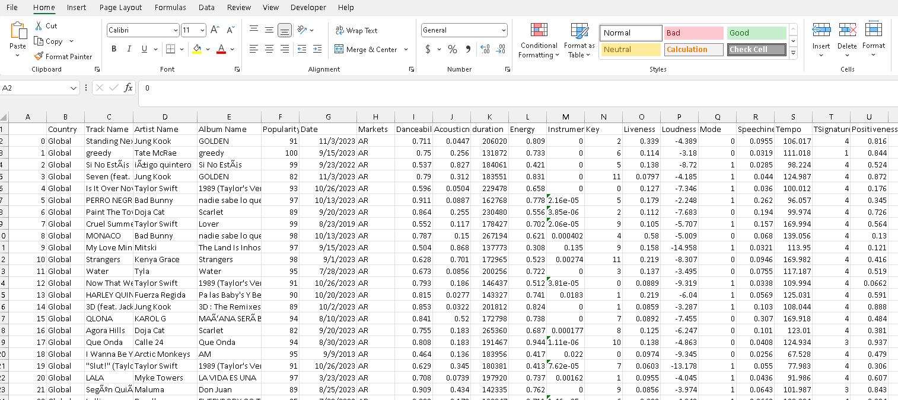
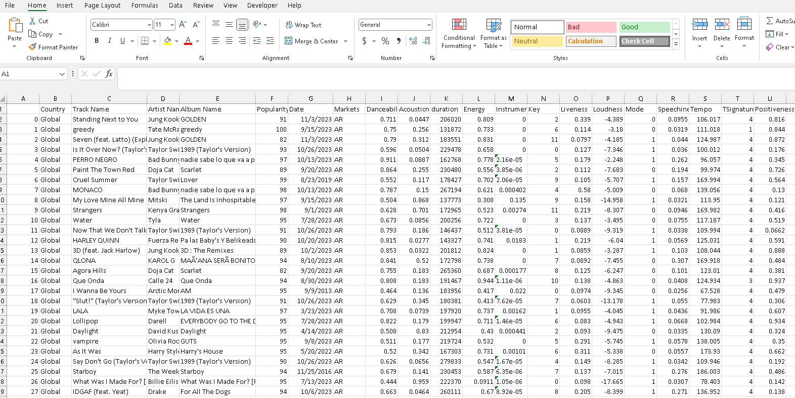

# Exploring-Music-Using-Spotify-Data

## General Information ##
Data pulled from Spotify that generated the top hits based on country as of 11/12/2023. 

## Technologies ##
Python, HTML, Javascript, SQLite, Flask, CSS

## Contributors ##
Andrew Voortman, Griffin Racey, Luke Payne, Damian Crim, Antonio Quintana, Amanda Baynard

## Data Sources ##
Spotify.com
Kaggle.com
alvarotrigo.com

## Table of Contents ##
    1. Pull and Clean Data 
    2. SQLite
    3. Flask Application
    4. Dashboard / HTML
    5. Dashboard / Javascript
    6. Maps

## Pull and Clean Data ##
Opened file from Kaggle.com (top-50-musicality-global.csv)
3,589 rows of data

*Removed all lines of data that contained foreign characters for easier use of file 
(Removed 727 lines of data)

Cleaned data:
2,862 rows of data

## SQLite ##
Created database of all music files using Python

## Flask Application ##
Created 3 Query Routes generated to create the visalizations

## Dashboard / HTML ##
Image of the dahboard

Code for the html dashboard

## Maps ##
Popularity and Danceablity of specific artists per country

