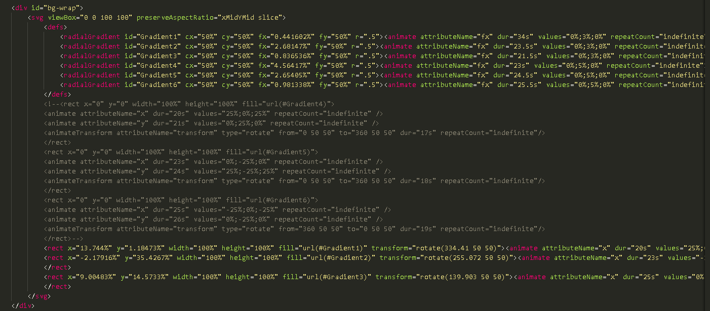

# Exploring-Music-Using-Spotify-Data

## General Information ##
Data pulled from Spotify that generated the top hits based on country as of 11/12/2023. 

## Technologies ##
Python, HTML, Javascript, SQLite, Flask, CSS

## Contributors ##
Andrew Voortman, Griffin Racey, Luke Payne, Damian Crim, Antonio Quintana, Amanda Baynard

## Data Sources ##
Spotify.com
Kaggle.com
alvarotrigo.com

## Table of Contents ##
1 Pull and Clean Data 
2 SQLite
3 Flask Application
4 Dashboard / HTML
5 Dashboard / Javascript
6 Maps

## Pull and Clean Data ##
Opened file from Kaggle.com (top-50-musicality-global.csv)
3,589 rows of data

*Removed all lines of data that contained foreign characters for easier use of file 
(Removed 727 lines of data)

Cleaned data:
2,862 rows of data

## SQLite ##
screenshots and explanation of what we did

## Flask Application ##
screenshots and explanation of what we did

## Dashboard / HTML ##
Creating a moving background with help from alvarotrigo.com

## Dashboard / Javascript ##
screenshots and explanation of what we did

## Maps ##
Our visualizations will include a world map displaying the top artists in each country, a breakdown of artist information in different countries, and a comparison of song popularity ratings. 

### Conclusion ###

